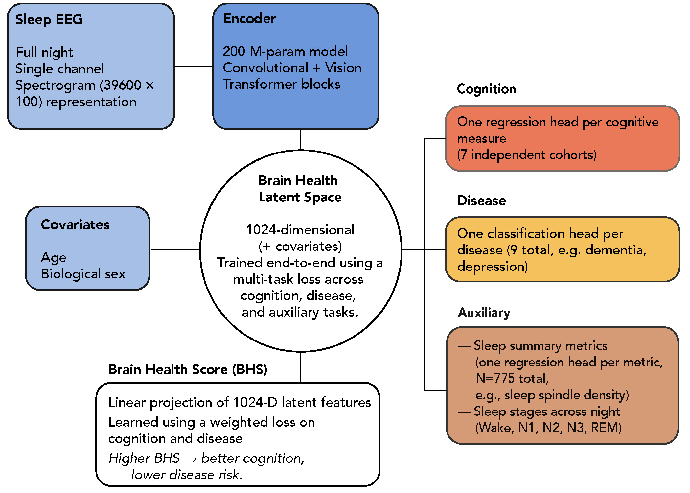

  

# Brain-Health Inference from Sleep EEG

**Philosophers-Stone** is a inference tool that converts a single-channel overnight sleep EEG into a quantitative index of brain health.

It applies a validated, peer-reviewed multi-cohort deep-learning model trained on **36,000 sleep recordings** to estimate cognitive performance, disease likelihoods, and mortality-related physiological patterns.

The tool outputs both a **single Brain Health Score** and a **1024-dimensional latent embedding** suitable for research and biomarker discovery.

  

## Scientific study

If you use or reference this tool, please cite the peer-reviewed study:

    Ganglberger, W., Sun, H., Turley, N., ... & Westover, M. B. (2026). 
    Brain Health from Sleep EEG: A Multicohort, Deep Learning Biomarker for Cognition, Disease, and Mortality. 
    NEJM AI, 3(3), AIoa2500487.

Available [here](https://ai.nejm.org/stoken/default+domain/6TDQIRG3F3D9QQPQ2PGW/full?redirectUri=doi/full/10.1056/AIoa2500487).

---

## Who is this for?

- Sleep scientists
- Neurologists and dementia researchers
- Aging and cognitive-decline investigators
- Psychiatry researchers
- Data scientists working with physiological signals
- Clinical-trial teams exploring EEG-based biomarkers

---

## What you get

- **Brain Health Score** (single interpretable metric)
- **1×1024 latent brain-health embedding**  (AI-derived sleep features)
- **Predictions** for cognition, disease risk, and mortality-related physiology
- **Optional outputs**: spectrograms and per-recording JSON summaries

---

## Requirements

- Python 3.10+
- Conda recommended

Recommended setup:

    ./run_sample.sh

This creates the recommended environment if needed, downloads the model checkpoint from Hugging Face, and runs the included sample files.

### Model file

Philosophers-Stone first uses `PHILOSOPHER_MODEL_FILE` when set. In a source
checkout it then looks for `./model_files/SleepPhilosophersStone.ckpt`;
package installs fall back to `~/.cache/philosophers-stone/model_files/`.
If the checkpoint is missing, explicit inference calls can auto-download it from:

- `https://huggingface.co/wolfgang-ganglberger/philosophers-stone`

## Inputs

### Manifest CSV

A CSV with columns:

- `filepath` (absolute path to EEG file)
- `age` (years)
- `sex` (0=female, 1=male)

### EEG File Requirements

Philosophers-Stone accepts **single-channel overnight EEG** in **HDF5 (.h5)** or **EDF (.edf)** format.
Preferred channel: **C4-M1**.

| Format        | Requirements |
|---------------|-------------|
| **HDF5 (.h5)** | - Dataset: `signals/c4-m1` (1-D float array, full night)   - Attributes: `sampling_rate=200`, `unit_voltage="uV"`   - Extra channels/annotations ignored   - Manifest uses absolute paths |
| **EDF (.edf)** | - Must contain a C4-M1 channel (label variants allowed)   - Any sampling rate accepted; auto-resampled to 200 Hz with anti-aliasing |

Sample full-night EEG data is included under `./sample-data/`.

---

## Quick start (CLI)

    python philosopher.py \
      --manifest_csv phi_manifest.csv

Or use the one-command conda bootstrap:

    ./run_sample.sh

Optionally, you can use Docker; see [the Docker ReadMe](docker/README.md).

## Optional package install

For applications that want to call Philosopher's Stone directly:

    pip install -e .

The package exposes an array-based API:

    from phi_utils.philosopher_utils import Config, infer_brain_health

    result = infer_brain_health(
        eeg_uv,
        fs_hz=200,
        age=65,
        sex=1,
        file_id="study-001",
        cfg=Config(),
    )

`eeg_uv` must be one overnight EEG channel in microvolts. The API does not
write output files; callers decide where to persist returned scores, latent
features, and optional stage probabilities.

---

## Outputs

- **Summary CSV** (`phi_out/phi_results.csv`)
  Columns include:
  `file_id, filepath, age, sex, brain_health_score, total_cognition_score, fluid_cognition_score, crystallized_cognition_score, lhl_1…lhl_1024`

- **Latent embedding (`lhl_1…lhl_1024`)**
  A 1024-dimensional vector summarizing brain-health-relevant EEG patterns.

- **Optional JSON files** under `phi_out/json/`
- **Optional spectrograms** under `phi_out/figures/`

---

## Performance tips

- Use a **GPU** if available
- Keep `batch_size=1`

---

## License

**CC BY-NC 4.0** — Attribution-NonCommercial 4.0 International.
See the `LICENSE` file for details.
